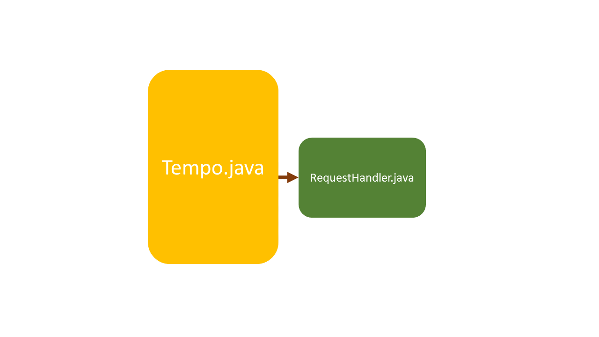
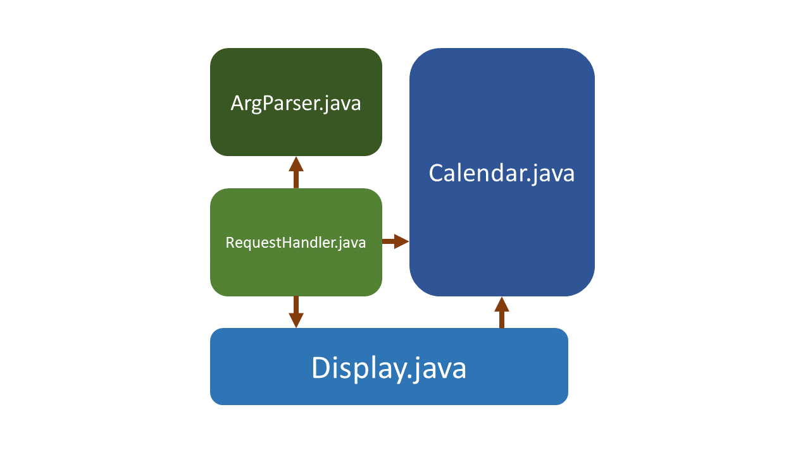
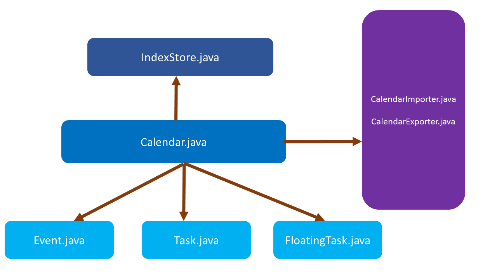
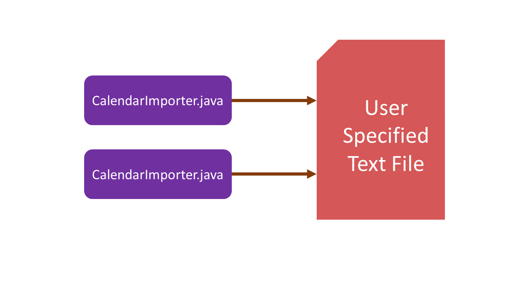

# About
Tempo is a simple tool that allows users to plan and manage their daily schedules using single line commands. With Tempo, you can now add, edit, search, delete, and view events and tasks - all with a single line command!

This guide aims to describe the design and implementation of Tempo. It will help you understand how Tempo works from a developer's point of view. 

We have organised this guide in a top-down manner so that you can understand Tempo from the big picture before moving on to the more detailed sections.

# Table of Contents
<!-- MarkdownTOC -->
- [Architecture](#architecture)
- [UI component](#ui-component)
    - [`Tempo` class](#Tempo-class)
- [Request Handling Component](#request-handling-component)
    - [`RequestHander` Class](#requesthandler-class)
    - [`ArgParser` Class](#argparser-class)
- [Logic Component](#logic-component)
    - [`Calendar` Class](#calendar-class)
    - [`Display` Class](#display-class)
    - [`IndexStore` Class](#indexstore-class)
    - [`Event`, `Task`,`FloatingTask` Classes](#event-task-floatingtask-classes)
- [Storage Component](#storage-component)
    - [`CalendarImporter` Class](#calendarimporter-class)
    - [`CalendarExporter` Class](#calendarexporter-class)
<!-- /MarkdownTOC -->

# Architecture

> Figure 1: Top-level design of Tempo 

Tempo is made up of four main components: 
1. The **`UI`** component is the main handle between the user and the rest of Tempo's componets. 
2. The **`Request Handling`** component contains all the logic needed to parse users' commands, conduct error correction and handling, before passing the commands to the respective logic components to perform CRUD functionalities. 
3. The **`Logic`** component comprises of all object representation of the user's data, as well as the CRUD logics to handle such data.   
4. The **`Storage`** component acts the main handler between the logic and the backend storage(a text file).  

After understanding the top-level design, we can take a look at the design of Tempo in terms of classes

> Figure 2: Breakdown of main classes of Tempo

#### Relationship Between Classes and their Logical Components
Component Name | Classes
----------- | ----------------------
`UI` | `Tempo`
`Request Handling` | `RequestHandler` Class   `ArgParser` class
`Logic` | `Calendar` class   `Display` class   `Event`, `Task`, `FloatingTask` classes
`Storage` | `CalendarImporter` class   `CalendarExporter` class

More extensive description of the functionalities of the classes are detailed as follow.

#UI component
This component is the main interaction interface into Tempo from the command line. It consists of one class, `Tempo`.

## `Tempo` class

> Figure 3: `Tempo`'s relation to other classes within Tempo

The `Tempo` class is the main entry/exit point for users in Tempo. It is also Tempo's only executable class from the command line. Also, Tempo is responsible for listening to inputs read by `RequestHandler` and when the *exit* command has been called, terminates the program.

#### Significant Methods
|Return Type | Method Name | Description|
| ------------- |-------------| ----------------|
| `void` |`listenForInput()`| Calls `readNextCommand()` from RequestHandler. Terminates the program if *exit* command has been inputed.|

# Request Handling Component
This component serves to function as the main instruction processor of Tempo. Translating and interpreting command strings as they are passed over by the UI into valid command arguments that the `Logic` component is able to process and execute. 

This component consists of two classes: The `RequestHandler` class and the `ArgParser` class.

## `RequestHandler` Class

> Figure 4: `RequestHandler`'s relation to other classes within Tempo

At the center of Tempo, is the `RequestHandler` class. Its function is to recieve commands that are passed in by the user, redirects them to `ArgParser` class for processing, before redirecting the processed command to the respective CRUD logics. 

<b>How `RequestHandler` works:</b> 
1. Recieves command string the user 
2. Pass the string to `ArgParser` for interpretation 
3. Pass the interpreted command by `ArgParser` and forwards the arguments to the respective CRUD logic (`Calendar` <b>OR</b> `Display`) components for execution 
  1. If `ArgParser` returns and error, it will forward the error to `Display` for the display of error message 
4. Returns command String to `Tempo` and waits for next command 

#### Significant Methods
|Return Type | Method Name | Description|
| ------------- |-------------| ----------------|
| `String` |`readNextCommand()`| Reads command from user and passes them to `ArgParser` for interpretation of command type.|
| `void` |`execute()`| Executes the interpreted command from `readNextCommand()` based on commad type as interpreted by `ArgParser()`.| 

## `ArgParser` Class
The `ArgParser` class is a semi-NLP class. Its function is to breakdown the command string passed by the `RequestHandler` and processes them before the `RequestHandler`  executes. In the event that the command that is passed is invalid, `ArgParser` will return an error message.

<b>How `ArgParser` works:</b> 
1. Recieves command string from `RequestHandler` class 
2. Interpretes the command type and return to the `ArgParser` 
3. Breakdown the rest of the command string into arguments for `RequestHandler` to handle 
4. In the event that the command is invalid, return an error 

#### Significant Methods
|Return Type | Method Name | Description|
| ------------- |-------------| ----------------|
| `void` |`initializeKeywords()`| Called during initialization of `ArgParser`. Matches keywords of similar command type to their respective commands.|
| `String` |`getCommand()`| Extracts the command type and returns it to `RequestHandler`.|

	
# Logic Component
This component serves to function as the CRUD logic of Tempo. It functions as the runtime **data store** for the OOP representation of the user's calendar items as well as the logic to **add**, **remove** and **update** the information is this datastore. It also contains the logic to display the information that is stored in this datastore for user to review their events, tasks and floating tasks.

This component consists of six classes: The `Calendar` class, `Display` class, `IndexStore` class, `Event` class, `Task` class and `FloatingTask` class

## `Calendar` Class

> Figure 5: `Calendar`'s relation to other classes within Tempo

The `Calendar` class is the main runtime data store which contains 3 main collection that stores `Event`, `Task` and `FloatingTask` objects. It is also the class that performs **add**, **remove** and **update** functions on the objects in the collection.

**How  `Calendar` works:** 
**Adding of Event/Task/FloatingTask:** 
1. Requests for next available index number from `IndexStore` class 
2.  Using the recieved index number from `IndexStore` as well as the arguments passed in by `RequestHandler`, proceeds to call the constructor for `Event` or `Task` or `FloatingTask` 
3. Once the object is created, stores the object in its respective collection 
4. Proceed to sort the collection based on chronological order
5. Exports the data in all collections to the user-specified text file using `CalenderExporter` class 
  
 
**Removing of Event/Task/FloatingTask:** 
1. Checks with `IndexStore` to determine the type of object to be removed (`Event`/`Task`/``FloatingTask`) based on the index 
2. Removes from respective collection based on the object type as determined by `IndexStore` 
3. Removes from `IndexStore` the association between the object to be removed and its index 
4. Exports the data in all collections to the user-specified text file using `CalenderExporter` class 

**Updating of Event/Task/FloatingTask:** 
1. Checks with `IndexStore` to determine the type of object to be updated(`Event`/`Task`/``FloatingTask`) based on the index 
2.  Updates the respective fields of objects from in their respective collection based on the object type as determined by `IndexStore` and field names and values passed in by `RequestHandler` 
3. Exports the data in all collections to the user-specified text file using `CalenderExporter` class 
 
#### Significant Methods
|Return Type | Method Name | Description|
| ------------- |-------------| ----------------|
|`void`|`addEvent()`  `addTask()`  `addFloatingTask()`| Calls the respective constructors for the respective object types and add them to their respective collections. Exports to text file after the operation.
|`void`|`remove()`|Removes the object from their collection based on its index. Exports to text file after the operation.|
|`void`|`update()`|Updates the fields of the object based on its index. Exports to text file after the operation.|
|`void`|`importFromFile()`|Called during initialization of `Calendar`. Imports existing data stored in the user-specified text file into their object representations and collections for `Calendar`.|
|`void`|`exportToFile()`|Writes the data in `Calendar` into the user-specifed text file.|

## `Display` Class
The `Display` class is the class that handles the display of all messages to the user. 

**How  `Display` works:** 
**Displaying of Calendar Items** 
1. Retrieves the appropriate collections (of `Event`/`Task`/`FloatingTask`) from `Calendar`  
2. Sorts and filters the collections based on **type/time**  
3. Displays the filtered results of `Events`/`Task`/`FloatingTask`  

**Displaying of Manual** 
1. Upon receiving the appropriate command from `RequestHandler`, prints the manual (pre-formatted) 

#### Significant Methods
|Return Type | Method Name | Description|
| ------------- |-------------| ----------------|
|`boolean`|`manual()`|Displays the user manual|
|`boolean`|`events()`   `tasks()`  `upcomingEvents()`  `undoneTasks()`  `missedTasks()`  `today()`  `all()` |Filters the collections based on display type and formats them for display to user.|

## `IndexStore` Class
The `IndexStore` class manages the index number that is given to each object (`Event`/`Task`/`FloatingTask`). It ensures that the index number given to each object is unique and should an object be deleted, it will recycle its index (*recycled index*) for future assignment.

Additionally, the `IndexStore` class is able to determine the type of a calendar object based on its index number.

 **How  `IndexStore` works:** 
1. Upon initialization, the `IndexStore` will recieve all object collections from `Calendar`
2. Based on the collection received from `Calendar`, the `IndexStore` will keep track of which index are used and which are not. At the same time, it will map the type of Calendar object to its' respective index.  
3.  When `Calendar` requests for an index, the index store will:
  1. Check if there are any *recycledindex* (index that were previously assigned but their objects have be subsequently removed)
  2. If there are *recycled index* available, `IndexStore` will return the first available *recycled index*
  3. If not, `IndexStore` will return the next available index 
4. Upon deletion of an object, `IndexStore` will:
  1. Remove the object from its index to object-type mapping
  2. Adds to the index of the removed object to the list of *recycled index*

#### Significant Methods
|Return Type | Method Name | Description|
| ------------- |-------------| ----------------|
|`void`|`initialiseStore()`|Runs during the initialization of `IndexStore`. Tracks which index are used and assigns also maps the index to its object type.|
|`int`|`getNewId()`|Returns the next index to be used to `Calendar`|
|`void`|`removeEvent()`   `removeTask()`|Remove the object from it's index-object type mapping and also to add the removed object's index to the *recycled index* list.|
|`boolean`|`isEvent()`   `isFloatingTask()`|Determines if object of specified index is an `Event` or `FloatingTask`|

## `Event`, `Task`, `FloatingTask` Classes
These are the OOP representation of the calendar objects. 

#### Significant Methods
|Return Type | Method Name | Description|
| ------------- |-------------| ----------------|
|`void`|`update()`|Updates the attributes of the object based on the field name.|
|`int`|`compareTo()`|Comapares the event based on their time in milliseconds from January 1, 1970. This is to ensure that the objects are compared according to their chronological sequence.|

# Storage Component
This component serves to act as the main Input/Ouput of data between Tempo and the user-specifed text file for persistent storage

> Figure 6: Storage component's classes' relationship with the user-specified text file

## `CalendarImporter` Class
The function of this class is to import the calendar data stored in the user-specified text file into application objects that `Calendar` can use.

It is run only once during each execution of Tempo (during start up).

**How  `CalendarImporter` works:** 
1. For each line in the user-specified text file, identify what type of calendar object it is (`Event`/`Task`/`FloatingTask`) and call its respective constructor. 
2. Add the newly created object into its collection based on its **type**. 

#### Significant Methods
|Return Type | Method Name | Description|
| ------------- |-------------| ----------------|
|`void`|`importFromFile`|Reads each line in the user-specified text file and determines its object types based on the number of fields (6 for `Event`, 4 for `Task` and 3 for `FloatingTask`). Calls their respective constructor and add them to their collection based on their types|
|`ArrayList`|`getEventsList()`   `getTasksList()`   `getFloatingTasksList()`|Returns the respective collection to `Calendar`.|
 
## `CalendarExporter` Class
The function of this class is to export the calendar data stored into the user-specified text file for the purpose of storing the user data in a more persistent form.

To keep the text file as updated as possible, is run during each instance of **add/remove/update** command.

**How  `CalendarImporter` works:** 
1. Receives the collections of `Event`, `Task` and `FloatingTask` from `Calendar`  
2. For each object in each collection, retrieves their attributes and write them into the text file. 

#### Significant Methods
|Return Type | Method Name | Description|
| ------------- |-------------| ----------------|
|`void`|`export()`|Writes the collections from `Calendar` to the user-specified text file.|
