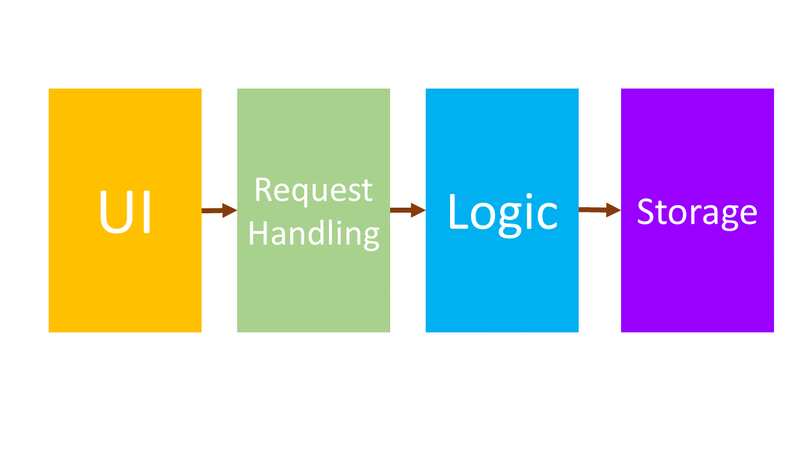
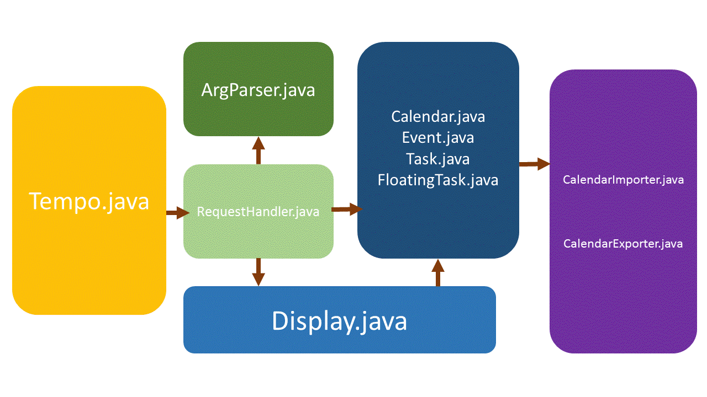

# About
//TO-DO

# Table of Contents
<!-- MarkdownTOC -->

- [Architecture](#architecture)
- [UI component](#ui-component)
    - [`Tempo` class](#Tempo-class)
- [Request Handling Component](#request-handling-component)
    - [`RequestHander` Class](#requesthandler-class)
    - [`ArgParser` Class](#argparser-class)
- [Logic Component](#logic-component)
    - [`Calendar` Class](#calendar-class)
    - [`Display` Class](#display-class)
    - [`IndexStore` Class](#indexstore-class)
    - [`Event`, `Task`,`FloatingTask` Classes](#event-task-floatingtask-classes)
- [Storage Component](#storage-component)
    - [`CalendarImporter` Class](#calendarimporter-class)
    - [`CalendarExporter` Class](#calendarexporter-class)

<!-- /MarkdownTOC -->

# Architecture

> Figure 1: Top-level design of Tempo 

Tempo is made up of four main components:
1. The **`UI`** component is the main handle between the user and the rest of Tempo's componets.
2. The **`Request Handling`** component contains all the logic needed to parse users' commands, conduct error correction and handling, 
before passing the commands to the respective logic components to perform CRUD functionalities.
3. The **`Logic`** component comprises of all object representation of the user's data, as well as the CRUD logics to handle such data.  
4. The **`Storage`** component acts the main handler between the logic and the backend storage(a text file). 

After understanding the top-level design, we can take a look at the design of Tempo in terms of classes

> Figure 2: Breakdown of main classes of Tempo

#### Relationship Between Classes and their Logical Components
Component Name | Classes
----------- | ----------------------
`UI` | `Tempo`
`Request Handling` | `RequestHandler` Class   `ArgParser` class
`Logic` | `Calendar` class   `Display` class   `Event`, `Task`, `FloatingTask` classes
`Storage` | `CalendarImporter` class   `CalendarExporter` class

More extensive description of the functionalities of the classes are detailed as follow.

#UI component
This component is the main interaction interface into Tempo from the command line. It consists of one class, `Tempo`.

## `Tempo` class
The `Tempo` class receives commands from the command line and passes them to the `RequestHandler` class in the 
Request Handling component to handle. It is also the main executable class for Tempo.

//TO-DO

# Request Handling Component
This component serves to function as the main instruction processor of Tempo. Translating and interpreting command strings as they are passed over by
the UI into valid command arguments that the `Logic` component is able to process and execute. 

This component consists of two classes: The `RequestHandler` class and the `ArgParser` class.

## `RequestHandler` Class
At the center of Tempo, is the `RequestHandler` class. Its function is to recieve commands that are passed in by the user, redirects them to 
`ArgParser` class for processing, before redirecting the processed command to the respective CRUD logics. 

<b>How `RequestHandler` works:</b>
1. Recieves command string from `Tempo` class
2. Pass the string to `ArgParser` for interpretation
3. Pass the interpreted command by `ArgParser` and forwards the arguments to the respective CRUD logic (`Calendar` OR `Display`) components for execution
	3.1 If `ArgParser` returns and error, it will forward the error to `Display` for the display of error message
4. Waits for next command from `Tempo`

#### Notable APIs
Method Name | Description
----------- | ----------------------

## `ArgParser` Class
The `ArgParser` class is a semi-NLP class. Its function is to breakdown the command string passed by the `RequestHandler` and processes them before the `RequestHandler`  executes. In the event that the command that is passed is invalid, `ArgParser` will return an error message.

<b>How `ArgParser` works:</b>
1. Recieves command string from `RequestHandler` class
2. Interpretes the command type and return to the `ArgParser`
3. Breaksdown the rest of the command string into arguments for `RequestHandler` to handle
4. In the event that the command is invalid, return an error

#### Notable APIs
Method Name | Description
----------- | ----------------------

	
# Logic Component
This component serves to function as the CRUD logic of Tempo. It functions as the runtime **data store** for the OOP representation of the user's calendar items as well as the logic to **add**, **remove** and **update** the information is this datastore. It also contains the logic to display the information that is stored in this datastore for user to review their events, tasks and floating tasks.

This component consists of six classes: The `Calendar` class, `Display` class, `IndexStore` class, `Event` class, `Task` class and `FloatingTask` class

#### Notable APIs
Method Name | Description
----------- | ----------------------

## `Calendar` Class
The `Calendar` class is the main runtime data store which contains 3 main collection that stores `Event`, `Task` and `FloatingTask` objects. It is also the class that performs **add**, **remove** and **update** functions on the objects in the collection.

**How  `Calendar` works:**
**Adding of Event/Task/FloatingTask:**
 1. Requests for next available index number from `IndexStore` class
 2.  Using the recieved index number from `IndexStore` as well as the arguments passed in by `RequestHandler`, proceeds to call the constructor for `Event` or `Task` or `FloatingTask`
 3. Once the object is created, stores the object in its respective collection
 4. Proceed to sort the collection based on chronological order
 5. Exports the data in all collections to the user-specified text file using `CalenderExporter` class
   
 **Removing of Event/Task/FloatingTask:**
//To-do

**Updating of Event/Task/FloatingTask:**
//To-do
 
## `Display` Class
The `Display` class is the class that handles the display of all messages to the user. 

**How  `Display` works:**
**Displaying of Calendar Items**
1. Retrieves the appropriate collections (of `Event`/`Task`/`FloatingTask`) from `Calendar` 
2. Sorts and filters the collections based on **type/time** 
3. Displays the filtered results of `Events`/`Task`/`FloatingTask` 

**Displaying of Manual**
1. Upon receiving the appropriate command from `RequestHandler`, prints the manual (pre-formatted)
## `IndexStore` Class
//To-do
## `Event`, `Task`, `FloatingTask` Classes
These are the OOP representation of the calendar objects 

# Storage Component
This component serves to act as the main Input/Ouput of data between Tempo and the user-specifed text file for persistent storage

## `CalendarImporter` Class
The function of this class is to import the calendar data stored in the user-specified text file into application objects that `Calendar` can use.

It is run only once during each execution of Tempo (during start up).

**How  `CalendarImporter` works:**
1. For each line in the user-specified text file, identify what type of calendar object it is (`Event`/`Task`/`FloatingTask`) and call its respective constructor.
2. Add the newly created object into its collection based on its **type**.
 
## `CalendarExporter` Class
The function of this class is to export the calendar data stored into the user-specified text file for the purpose of storing the user data in a more persistent form.

To keep the text file as updated as possible, is run during each instance of **add/remove/update** command.

**How  `CalendarImporter` works:**
1. Receives the collections of `Event`, `Task` and `FloatingTask` from `Calendar` 
2. For each object in each collection, retrieves their attributes and write them into the text file.
